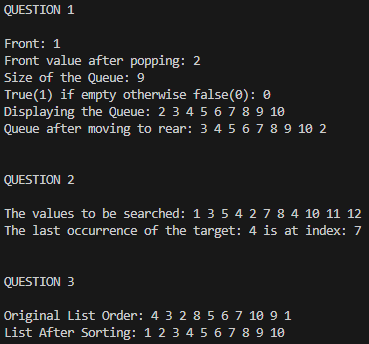

# Comp-Sci 303 - Assignment 3

There are three programs included in this assignment. The first creates a Queue from a singly linked list that mimics the functionality of the standard template library Queue. The second uses a vector to implement a recursive linear search for the last occurrence of an element in the vector. The third is an implementation of insertion sort using the standard template library list.

The function declarations can be found in the my-queue.h, recursive-linear-search.h, and list-insertion-sort.h Header files.

The function declarations can be found in the my-queue.cpp, recursive-linear-search.cpp, and list-insertion-sort.cpp files.

In order to run the code you can use a compiler of your choice to compile the code in the main.cpp file and run it with the example input given below.

## Example Input - Question 1

## Example Input - Question 2

## Example Input - Question 3

## Example Output

